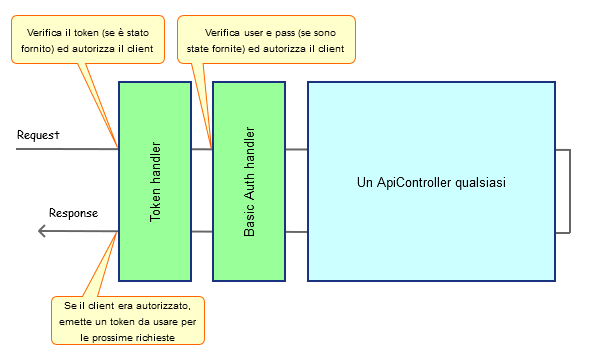

ASP.NET Web API 2 Basic Auth & JWT Token Demo
=============================================

Questo progetto dimostrativo supporta due meccanismi di autenticazione contemporaneamente:
 * Basic Authentication
 * Token JWT

Entrambi sono stati implementati come due DelegatingHandlers
(cioè elementi della pipeline di ASP.NET Web API 2) il cui codice si trova nella
sottodirectory "Sicurezza" del progetto.

***
**Questo codice è dimostrativo e non andrebbe usato in produzione così com'è **
***

Funzionamento
-------------
Il client è libero di inviare una richiesta ad un ApiController qualsiasi 
fornendo username e password per autenticarsi con la Basic Authentication.
Se le credenziali erano corrette, ASP.NET Web API 2 restituirà la risposta e verrà inoltre
emesso un token nell'intestazione di risposta Server-Authentication che il client
potrà raccogliere ed usare nelle successive richieste.

Il token emesso in questo modo può avere una scadenza molto breve (es. 5 minuti) e verrà
rinnovato ad ogni richiesta del client. Questo comportamento è disattivabile commentando
la riga 44 di TokenHandler.cs.
 

 
Token JWT
---------
Questo progetto usa il pacchetto NuGet [System.IdentityModel.Tokens.Jwt](https://www.nuget.org/packages/System.IdentityModel.Tokens.Jwt/4.0.2.206221351)
per emettere e validare i Token.
Un [Token JWT](https://jwt.io/) contiene i *claims* dell'utente che si era autenticato in precedenza con la Basic Authentication.
I claims sono serializzati in formato JSON e firmati digitalmente per impedire la manipolazione del client.
Quando il token viene inviato dal client con la sua richiesta, viene validato dal server per verificarne l'integrità.

Dopo che il server ha validato il contenuto del Token, potrà estrarre da esso
il nome utente, il suo id, i suoi ruoli o qualsiasi altra informazione avremo scelto
di inserirvi all'atto dell'emissione. E' ovvio che, più informazioni inseriamo, più
pesante risulterà il token.

Configurazione e avvio dell'applicazione
----------------------------------------
Prima di avviare l'applicazione, impostare la ChiaveSimmetrica nel web.config. In questo esempio la chiave è un Guid.

La pagina index.htm sarà il nostro client javascript (ma il client può essere un'app mobile o qualsiasi altro dispositivo).
La pagina chiederà all'utente di inserire le credenziali e poi recupererà il token dalla risposta e lo userà in tutte le successive richieste.
In questo esempio, gli utenti sono stati cablati nel codice nel file App_Start/WebApiConfig.cs. Loggarsi con queste credenziali:
 * Username: admin
 * Password: password
